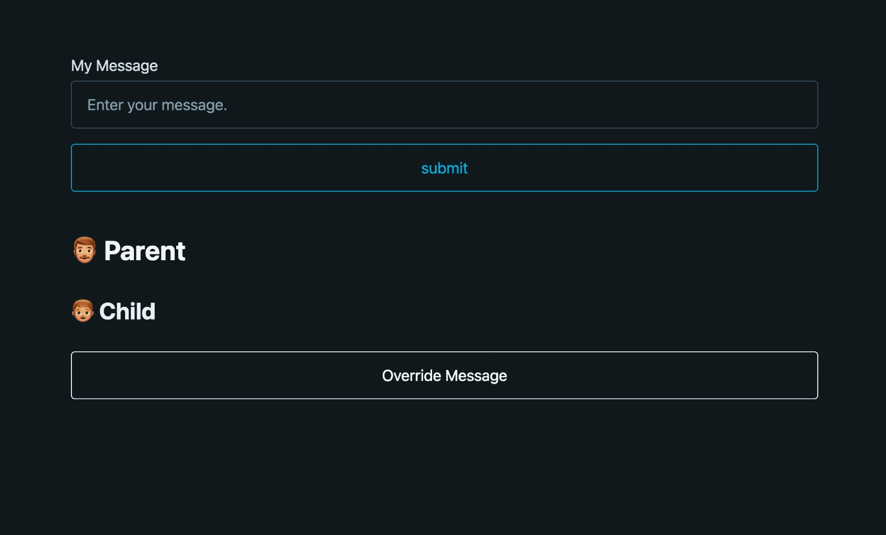

# Practice useContext

Here is a practice of the useContext hook, which is a React hook that allows you to access global data and re-render when that global data is changed.

 

## Website
* 👉 [jsohndata.github.io/practice-react-usecontext](https://jsohndata.github.io/practice-react-usecontext)

 

## Additional article
* [docs-react/useContext](https://github.com/jsohndata/docs-react/blob/main/useContext.md)

 

## CSS FrameWork
* [picocss.com](https://picocss.com/docs)